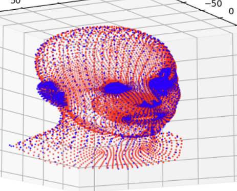
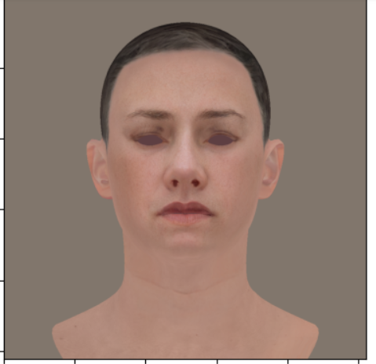
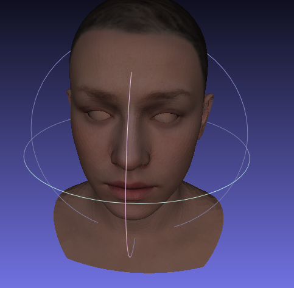

# FLAME_TO_HACK
Scripts to convert FLAME face model's uv typology to HACK model(same facial topology as ICT-FaceKit). 

The repo contains 3 works. 

1. Registration between HACK's mesh and FLAME's mesh.
2. Generate UV mapping by training a neural network
3. Photo-metric Fitting for HACK with in-the-wild images

## Usage

Put this repo code in HACK's git repo folder, run the code in jupyter-nobook.

## Description

### Registration between HACK's mesh and FLAME's mesh.
The HACK Model is a head model consists of a base topology along with definitions of facial landmarks, shape blendshapes, expression blendshapes, cervical joints, and pose blendshapes. More informations can be found here in this repo [HACK](https://github.com/ZoneLikeWonderland/HACK-Model)

For some reason, HACK didn't release its texture model. This Repo provides some scripts for converting FLAME's texture to HACK.

HACK and FLAME have different typology(different vertex number and face). So I implement non-rigid icp method using point to plane loss to make them have almost similar 3D structure. 

There are many problems aligning these two meshes, I mask all eyes and mouth regions when aligning meshes. FLAME has eye-ball, HACK doesn't have eye-ball structure and HACK has mouth socket. This will result in inaccurate alignment between the eyes and mouth. HACK has a more complicated nostril structure, which makes it impossible to achieve alignment when aligning two meshes. I design a ellipse based loss for aligning the nose, which is very very important. HACK has more than twice as many vertexes and faces than FLAME, which will make the registration result inaccurate if using point to point icp, I choose to use point to plane icp in the end.

More detail should be compared in blender.

### Generate UV mapping by training a neural network
I have tried to get the coordinates by finding the nearest face from HACK vertexes to FLAME faces, then get the uv coordinates by its barycentric coordinates. It works fine in most case. However, some "hole regions" like nose, mouth and eyes do not work fine. In the end, I decided to use a neural network to "overfitting" a uv mapper, the network predicts uv coordinates with 3d points input.

Refer to "AUV-Net: Learning Aligned UV Maps for Texture Transfer and Synthesis", I implement the mapping network by training a MLP to predict the uv coordinates of 3D points. I use FLAME's 3D points and its uv coordinates for training. Then use the network to predict the uv coordinate of aligned HACK vertex.

The paper itself uses Voxel information for training, I did some experiments and it implies that using a mapping network itself is enough for this task. 

Smoothness of the network matters. Too complicated model structure will make the mapping function discontinuous in some way. I have tried spectral_norm, gradient penalty, and local smooth consistence, spectral_norm and local smooth consistence work best.

To get a perfect nose texture, I train the mapping network with multi-view rendering loss. Then we will get a good texture coordinates and rendered like this:

### Photo-metric Fitting for HACK with in-the-wild images

Thanks to [FFHQ-HV](https://github.com/csbhr/FFHQ-UV.git), it publish a UV image generator with Style-GAN2. I free this generator network and optimize the z code for photo-metric fitting. This process is done with the help of differentiable rendering.

CODE will be released in a week.

## Related projects
- [HACK](https://github.com/ZoneLikeWonderland/HACK-Model)
- [FLAME](https://flame.is.tue.mpg.de)
- [FFHQ_HV](https://github.com/csbhr/FFHQ-UV.git)

